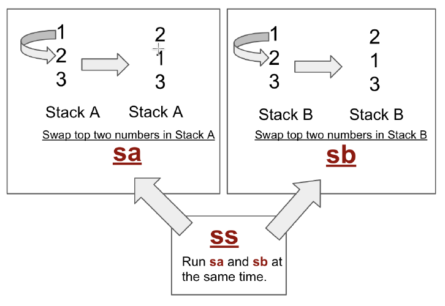
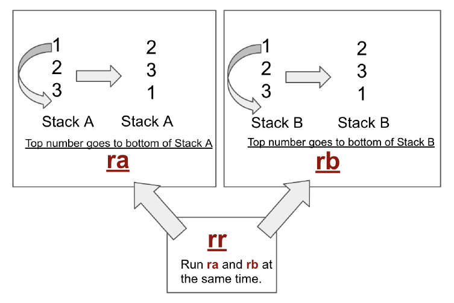
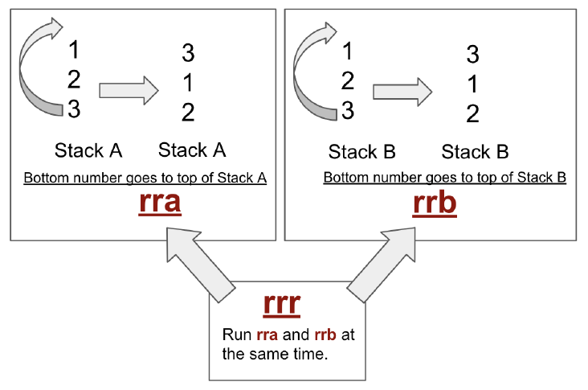
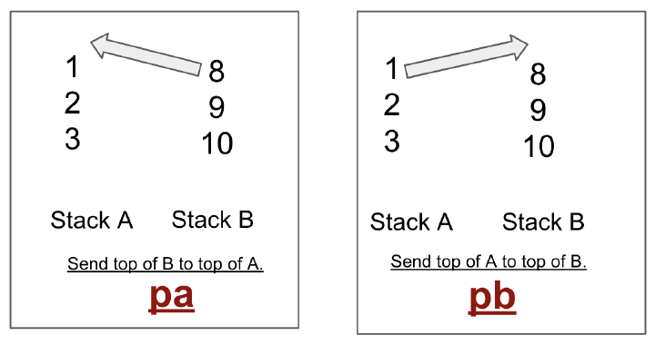
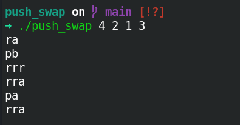
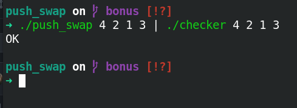

# push_swap

A sorting algorithm based on two stacks

## Main program

### Description
* **push_swap** is a program that takes a list of integers as input and sorts it in ascending order.
* The program prints the instructions used to sort the list of integers.
* The provided list of integers should have no duplicate numbers and should not surpass 4 bytes integer range.
* The program uses two stacks to sort the list of integers: Stack A and Stack B.
* The set of instructions **push_swap** might use is the following: **sa**, **sb**, **ss**, **ra**, **rb**, **rr**, **rra**, **rrb**, **rrr**, **pa** and **pb**

#### Swap instructions


#### Rotate instructions


#### Reverse rotate instructions


#### Push instructions


### Usage
```sh
git clone https://github.com/Archer-01/push_swap.git
cd push_swap
make
```
```sh
./push_swap [list_of_integers]
```

### Demo



## Bonus program

### Description

**push_swap** is associated with another program named
**checker**

* The **checker** program takes a list of integers as input and checks if the list is sorted in ascending order.
* The program reads from standard input for instructions, if numbers get sorted the program prints **OK** followed by a newline, otherwise it prints **KO** followed by a newline.

### Usage

```sh
git clone https://github.com/Archer-01/push_swap.git
cd push_swap
git checkout bonus
make bonus
```
```
./checker [list_of_integers]
```

### Demo



[](https://forthebadge.com)
